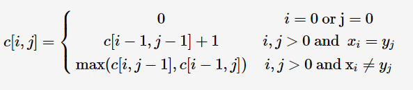

最长公共子序列长度

[poj.org 1458](http://poj.org/problem?id=1458)

<!-- more -->

状态转移方程：


最长公共子序列长度C++代码实现：

```cpp
#include <iostream>
#include <string>
#include <vector>
#include <algorithm>

using namespace std;

int LCS(string a, string b)
{
	int la, lb;
	la = a.length();
	lb = b.length();
	vector<vector<int>> c(la + 1, vector<int>(lb + 1, 0));

	for (int i = 1; i <= la; i++)
		for (int j = 1; j <= lb; j++)
		{
			if (a[i - 1] == b[j - 1])
				c[i][j] = c[i - 1][j - 1] + 1;
			else
				c[i][j] = max(c[i - 1][j], c[i][j - 1]);
		}

	return c[la][lb];
}

int main()
{
	string a, b;
	while (cin >> a >> b)
	{
		cout << LCS(a, b) << endl;
	}
    return 0;
}
```

