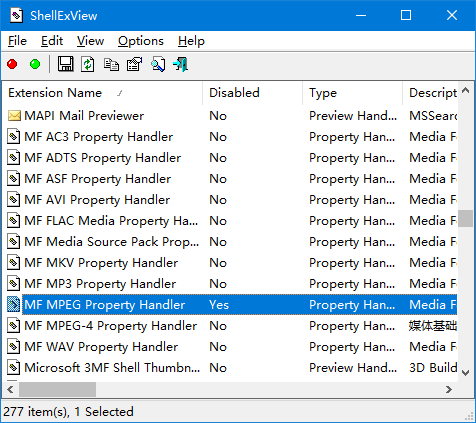

>ts文件卡死是怎么回事呢？ts文件相信大家都很熟悉，但是卡死是怎么回事呢？下面就让小编带大家一起了解吧。
>ts文件卡死，其实就是卡死了。那么ts文件为什么会卡死，相信大家都很好奇是怎么回事。大家可能会感到很惊讶，ts文件怎么会卡死呢？但事实就是这样，小编也感到非常惊讶。那么这就是关于ts文件卡死的事情了，大家有没有觉得很神奇呢？
>看了今天的内容，大家有什么想法呢？欢迎在评论区告诉小编一起讨论哦。

<!-- more -->

## 症状

右键大小较大的.ts文件经常会出现资源管理器卡死或长时间未响应的情况

## 解决

### 暴力方案

直接删除`mfmpeg2srcsnk.dll`

### 正常方案

下载并打开 [shexview](http://www.nirsoft.net/utils/shexview.html) ，找到`MF MPEG Property Handler`，右键Disable即可

## Icaros

使资源管理器支持所有媒体格式的缩略图以及详细信息的软件

[下载链接](https://www.majorgeeks.com/files/details/icaros.html)

