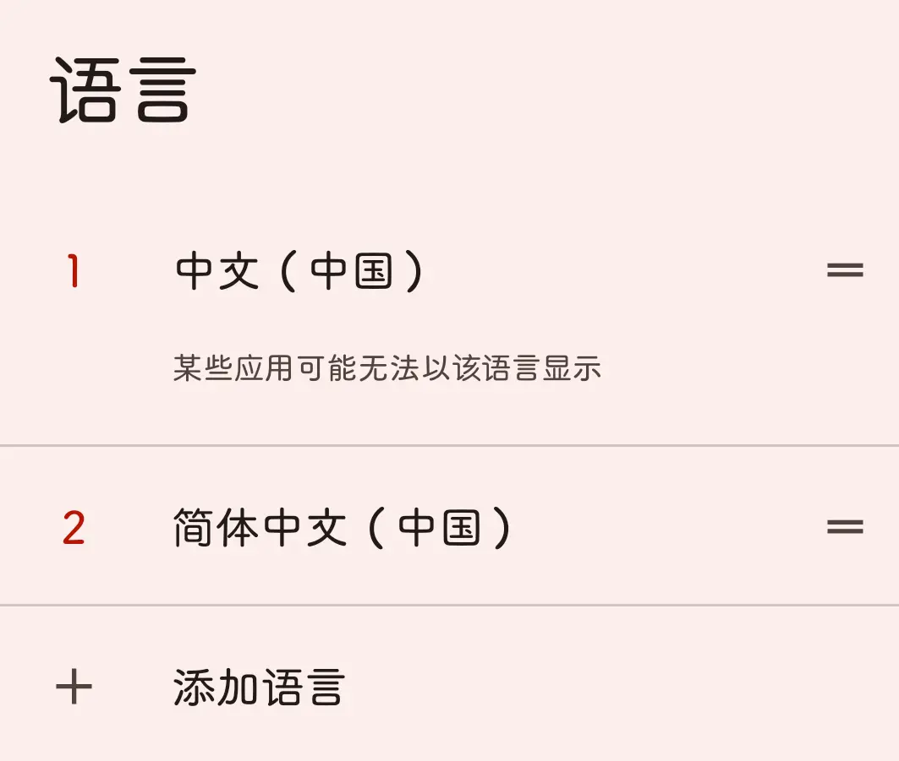
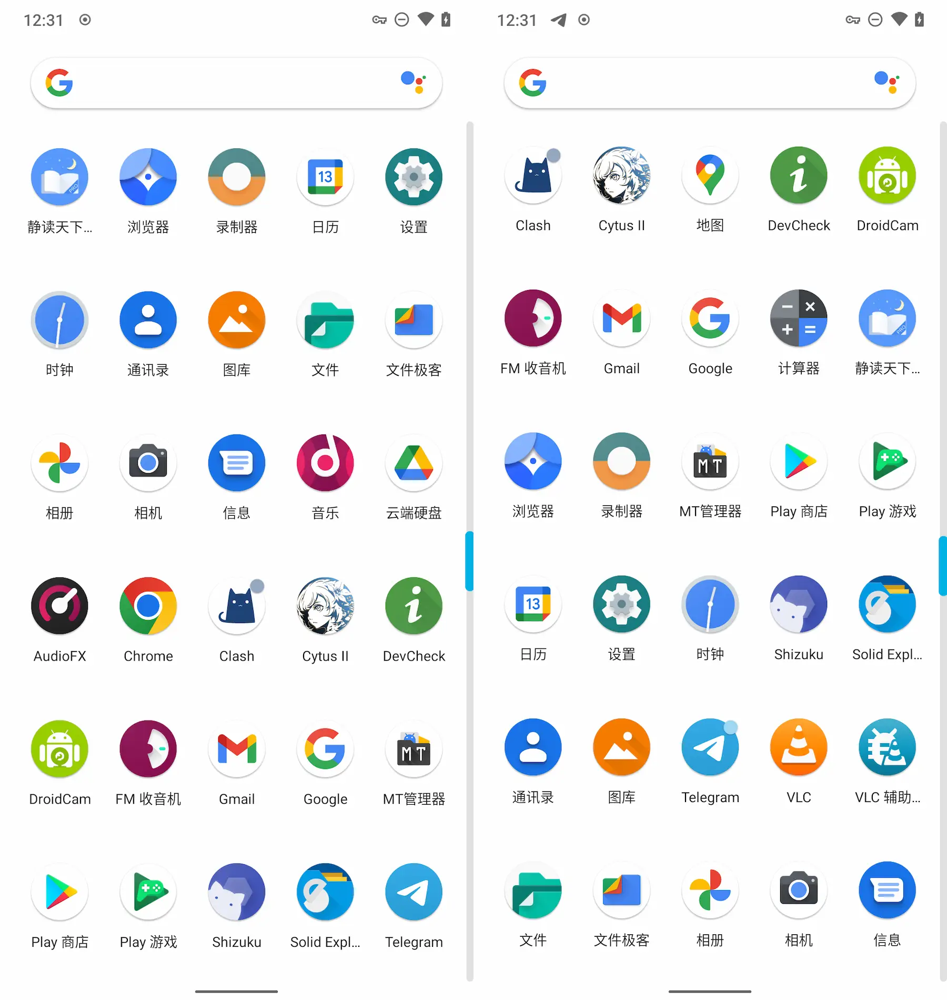

使用 ADB 开启 Lawnchair 应用抽屉的中英混排 无需root

<!-- more -->

##  问题描述

在类原生系统的初次开机设置时，如果检测到国内SIM卡，系统会自动将语言切换成 `中文（中国）` ，而这个语言在系统的 `添加语言` 列表里面是没有的，你只能找到 `简体中文（中国）`



类原生自带的启动器（QuickStep、Lawnchair 等）在 `简体中文（中国）` 下，应用抽屉会按照中文在前，英文在后（或者反过来）的方式排序，并且缺少相关的设置项；而在 `中文（中国）` 下，这些启动器可以正常按照中文拼音首字母进行中英混排



## 解决方案

手机连接电脑开启USB调试，输入

```
adb shell settings put system system_locales zh-CN,zh-Hans-CN
```

重启，完成

