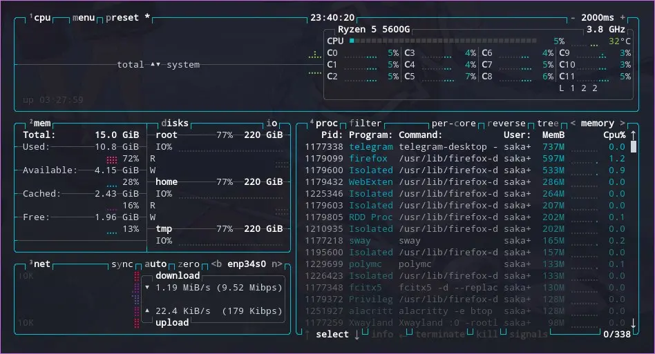

众所周知，Java版的Minecraft是会吃掉很多内存的，但最大内存也会受到 `-Xmx` 等JVM参数的限制。如果它占用的内存能达到两倍的最大内存限制，甚至能吃掉所有的物理内存+虚拟内存，显然是不合理的。

<!-- more -->

## 相关 Issue

[radeonsi: VRAM Leak/abnormally high usage in Minecraft mod pack ](https://gitlab.freedesktop.org/mesa/mesa/-/issues/6140)

问题已在新版 mesa 中有所缓解

## 环境

```
OS: Arch Linux x86_64
Kernel: 5.18.12-zen1-1-zen
CPU: AMD Ryzen 5 5600G with Radeon Graphics (12)
GPU: AMD ATI Cezanne
GPU: AMD ATI Radeon RX 580
Memory: 16GB
mesa 22.1.3-1
```

```
Minecraft 1.7.10
GTNewHorizons-1.7.10-2.1.2.3qf
polymc 1.3.2
```

## 过程

### 初遇问题

给 Minecraft 分配最大 8GB 内存，加上其他程序和系统的占用，游戏打开进入服务器后内存占用会在 10GB 左右浮动，游戏过程中内存占用会不断增加，甚至用尽物理内存。此时的 java 内存占用在 10GB 左右，但 `free -h` 显示如下（具体数值是我编的可能对不上但大概是这个意思）

```
            total        used        free      shared  buff/cache   available
内存：       15Gi       14.9Gi       0.5Gi       228Mi       0.5Gi       1.1Gi
交换：       17Gi         8Gi         9Gi
```

可以看出不仅物理内存用尽，虚拟内存也使用了很大一部分，但很明显已使用的内存和各进程的内存占用总和对不上。此时 Minecraft 已经开始由于内存不足进行高强度 GC 而产生间歇性卡顿，此时如果不关闭MC，待虚拟内存消耗殆尽时会因为 OOM 强行终止掉 java 进程，或者崩掉其他进程。最严重的一次似乎是崩掉了 systemd， poweroff 和 journalctl 都没有响应，其次是崩掉了 sway 窗口管理器

但问题就来了， java 进程终止后，内存占用依旧异常，很明显我的所有进程的内存使用量总和是不可能有下图所示10.8GiB这么多的，那么多出来的内存都去哪了呢



### 分析内存

根据 [/proc/meminfo之谜](http://linuxperf.com/?p=142) 给出的公式分析内存

```
MemTotal = MemFree +【Slab+ VmallocUsed + PageTables + KernelStack + HardwareCorrupted + Bounce + X】+【Active + Inactive + Unevictable + (HugePages_Total * Hugepagesize)】
```

发现多占用的内存数量与公式里的 X 接近，注解里表示 `X表示直接通过alloc_pages/__get_free_page分配的内存，没有在/proc/meminfo中统计，不知道有多少，就像个黑洞。` 猜测或许是 java 引发了内存泄漏

### 更换 jdk

此前使用的一直是 AUR 中的 jdk8-graalvm-bin，尝试更换如下几个版本的 jdk，并设置对应的 JVM 参数，但并没有明显改善

- Oracle jdk8
- jdk8-dragonwell
- jdk8-adoptopenjdk
- jdk8-openjdk-shenandoah
- jdk8-openj9

题外话，这些 jdk 之中，内存占用和性能表现最优秀的大概是 jdk8-dragonwell，有兴趣的可以试试
[Alibaba Dragonwell8 JDK](https://github.com/alibaba/dragonwell8)

### 增删 mod

由于 GTNH 这个整合包的 mod 数量有250+个，没办法一个个测试内存问题，只单独把几个优化相关的 mod 加加减减测试数次但问题依旧，直到添加了一个性能分析 mod，它告诉我现在在用核显跑 Minecraft，使用 `nvtop` 观察，分配的 512MB 核显显存此时将近满载，java 进程消耗了大约 200MB 的显存（至少他是这么写的）

### 核显独显

在双显卡的 Linux 平台上，核显独显的切换可以通过使用 `DRI_PRIME` 实现，比如 `DRI_PRIME=1 vkcube` 就会调用我的独显运行

而在 polymc 上，我设置的 `env DRI_PRIME=1` 并没有生效， Minecraft 依然在使用默认值也就是核显运行。重新设置 polymc，在 `自定义命令-包装器命令` 中填入 `sh -c "export DRI_PRIME=1;gamemoderun $INST_JAVA \"$@\""` ，启动，通过 `radeontop` 和 `nvtop` 监控，成功在独显上运行

### 显存

那问题是不是解决了？并没有，内存依然会溢出，但是比以前撑的时间更长了，使用 `radeontop` 和 `nvtop` 查看，发现独显的 4GB 显存已经满了，Minecraft 这个游戏能使用满 4GB 的显存明显是很不合理的，即使是这么多 mod 的大型整合包。重启再开发现，显存占用满之前内存占用都是正常的，而显存满了之后，内存占用就开始不正常了

所以现在谜底已经很明显了，多出来的那部分 X ，就是被当成显存使用的内存。

使用核显的时候分配的 512MB 的显存是不够用的，就会把物理内存当成显存来用，这部分就是 `radeontop` 中的 `GTT`。独显也一样，独立的显存能缓解内存爆掉的速度，但总还是会爆的

### 编译

知道了是显存占用问题而非内存问题后，搜到了这么一个 issue

[radeonsi: VRAM Leak/abnormally high usage in Minecraft mod pack](https://gitlab.freedesktop.org/mesa/mesa/-/issues/6140)

症状几乎和我遇到的一模一样，评论指出了可能的解决方案，通过降低 mesa 某段代码中的 buffer size 可以缓解显存占用问题，开始准备重新编译 mesa

以下步骤基于 ArchLinux，其他发行版不能直接使用，但可以参考并手动修改编译

1. 使用 `asp` 获取 mesa 的 `PKGBUILD`
   
    ```bash
    mkdir ~/build
    cd ~/build
    asp update mesa
    asp export mesa
    cd mesa
    ```
1. 修改 `PKGBUILD`

    在 `prepare()` 中添加一行 sed 命令

    ```
    prepare() {
      cd mesa-$pkgver
      sed -i 's/20\*1024\*1024/20\*1024/g' src/mesa/vbo/vbo_save.h
    }
    ```

1. 编译
   
    ```bash
    makepkg -s
    ```

    若提示 PGP 错误可尝试

    ```bash
    makepkg -s --skippgpcheck
    ```

1. 安装
   
    编译完成后目录下会有许多包，安装自己需要的包

    ```bash
    sudo pacman -U mesa-22.1.3-1-x86_64.pkg.tar.zst
    ```

### 测试

重启之后打开 Minecraft 测试，四个小时左右显存占用只有 1GB，虽然可能治了标没治本，但起码不用每一个小时重启电脑释放内存了

## 总结

TL;DR，解决此问题最有效的方法就是重新编译修改过的 mesa，但为什么他们会设置这么大的数值咱也不知道，至少在这个基于 Minecraft 1.7.10 的 GTNH 整合包之外的游戏里显存表现都没有什么问题，可能是旧版JDK + 旧版Minecraft + 大型整合包带来的三重 DEBUFF 吧


