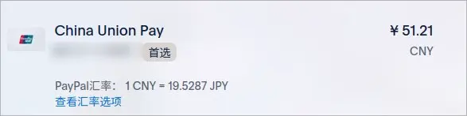
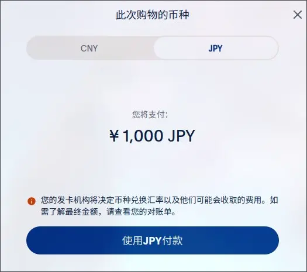

购买作品时，1点数=1 JPY，可用于支付。

<!-- more -->

## 前言

DLsite 目前提供的点数购入网站一共有下面几种：

- [Dianshu.JP](https://dianshu.jp/dl)

  - 支持支付宝

  - 汇率较高

- [DLPay](https://dl-pay.com)

  - 支持绑定了银联的 PayPal 账户

- [For Books](https://forbooks.jp/zh-hans/products/dld003p)

  - 大概只支持境外卡（未测试）

## 汇率陷阱

### Dianshu

Dianshu 作为 DLsite 官方推荐的中国大陆的支付方式，自然是最方便的，但是相对的其汇率较高

站内给出的预估汇率为大概 1000JPY <-> 53RMB （未实际购买不确定是否为最终结算汇率）

作为参考，本日（2024-08-12）的汇率为 1000JPY <-> 48.53RMB，足足贵出 5%。

因此在拥有其他支付方式时不建议直接使用 Dianshu

### DLPay

DLPay 的购买要求输入电子邮箱，之后会往邮箱内发送一封包括购买点数购买链接的邮件，点击链接并登录 Paypal 后进入付款方式选择的界面

可以看到此时的汇率为 1000JPY <-> 51.21RMB，比 Dianshu 便宜一些，但仍比汇率贵上不少

点击 `查看汇率选项`，将币种改为 JPY

这样会使用发卡组织的汇率结算，而非 Paypal 提供的汇率结算

最终实际支付 49.03RMB，跟汇率非常接近

## 总结

购买 DLsite 点数时使用 DLPay 并修改 Paypal 此次购物使用的币种为 JPY
