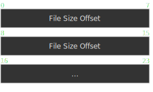

## Introduction

PFS is a proprietary archive format used by the [Artemis](https://www.ies-net.com/) visual novel engine. This format serves as a container for game assets, allowing developers to package multiple files into a single archive for distribution and efficient asset management.

This document provides a complete technical specification of the PFS file format, reverse-engineered through analysis of actual game files. The information presented here enables developers to create tools for extracting, analyzing, and manipulating PFS archives.

### Related Tools

I have developed several tools for working with PFS files:

- **[pf8](https://crates.io/crates/pf8)** - A Rust library providing encoding and decoding functionality for PFS files
- **[pfs-rs](https://github.com/sakarie9/pfs-rs)** - A command-line tool for packing and unpacking PFS archives



## PFS File Format Structure

The PFS format uses a structured approach to store file metadata and data. The format consists of a header section containing file indices and metadata, followed by the actual file data. This design allows for efficient random access to individual files within the archive.



**Important:** All multi-byte values in PFS files are stored in little-endian byte order.



## Header Structure

| Offset   | Size              | Name                   | Description                                                                                         |
| -------- | ----------------- | ---------------------- | --------------------------------------------------------------------------------------------------- |
| 0x0      | 0x3               | Magic Number           | File signature: `pf8`                                                                               |
| 0x3      | 0x4               | Index Size             | Size from File Count start to File Size Count Offset end: `[0x7, 0x1B+X+Y)`                         |
| 0x7      | 0x4               | File Count             | Total number of files in the archive                                                                |
| 0xB      | X                 | File Entries           | Array of file entry structures. [See Below](#link-file-entry)                                       |
| 0xB+X    | 0x4               | File Size Count        | Number of file size entries (File Count + 1)                                                        |
| 0xF+X    | Y=0x8*(filecount) | File Size Offsets      | Array of 8-byte offsets pointing to file sizes in File Entries. [See Below](#link-file-size-offset) |
| 0xF+X+Y  | 0x8               | File Size Offset End   | Padding bytes (filled with zeros)                                                                   |
| 0x17+X+Y | 0x4               | File Size Count Offset | Offset to File Size Count field, calculated from position 0x7                                       |

## File Entry Structure {#link-file-entry}

For clarity, offsets shown below start from 0x0. Remember to add the file entry base offset of 0xB when working with the complete PFS file.

| Offset | Size             | Name             | Description                                                                           |
| ------ | ---------------- | ---------------- | ------------------------------------------------------------------------------------- |
| 0x0    | 0x4              | File Name Length | Length of the filename in bytes                                                       |
| 0x4    | X=FileNameLength | File Name        | Filename string (length specified by previous field)                                  |
| 0x4+X  | 0x4              | Null Terminator  | String terminator (filled with zeros)                                                 |
| 0x8+X  | 0x4              | Offset           | Absolute offset to file data within the PFS file.[See Below](#link-file-data-offsets) |
| 0xC+X  | 0x4              | File Size        | Size of the file data in bytes                                                        |

### Understanding File Data Offsets {#link-file-data-offsets}

The offset field in each file entry represents the absolute position of the file data within the entire PFS file, **not** relative to the file entry itself.

**Example:**
For a file entry with `offset=0xBD` and `size=0x000326C8`, the file data spans from byte `0xBD` to byte `0xBD + 0x000326C8` in the PFS file. In array notation: `&pfs[offset..offset+size]`.

## File Size Offset Structure {#link-file-size-offset}

Each entry in the File Size Offsets array is an 8-byte offset value that points to the corresponding file size within the File Entries section.

**Important:** The offset is calculated relative to position 0xF (the start of the File Size Offsets array).

**Example:**
If a file size offset contains the value `0x25`, the actual file size can be read from `&pfs[0x25 + 0xF..0x25 + 0xF + 0x4]`.
