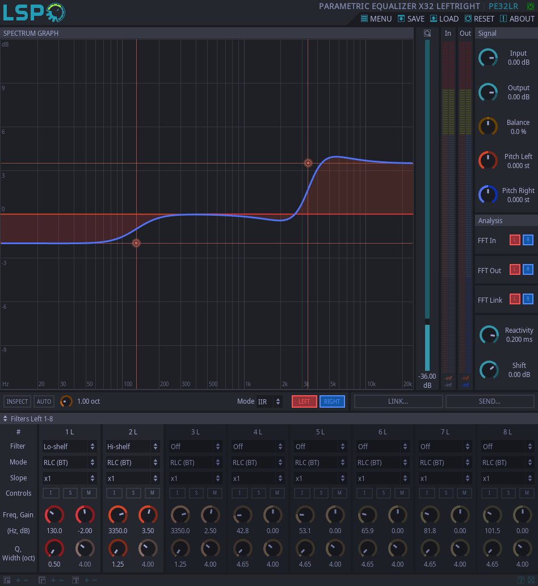
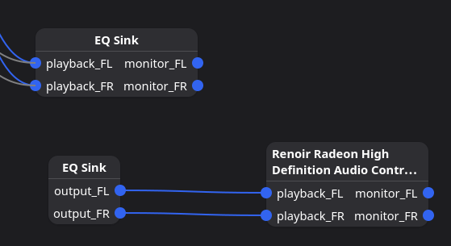

## 前言

虽然在 Linux 上在输出设备上应用均衡器等音效的一般实践是使用 EasyEffects，但对于简单的均衡器来说，EE 太重了，而且在使用时偶尔会出现音频卡顿等奇怪的现象。正好 Pipewire 本身就有配置音效的功能，所以本文尝试使用 Pipewire 实现均衡器。

## 准备

首先确保 Pipewire 已经安装并正常运作。

然后明确要配置的 EQ 的参数，例如参数均衡器：

```
Filter 1 : ON LSC Fc 105.0   Hz Gain 0.6  dB Q 0.70
Filter 2 : ON PK  Fc 37.7    Hz Gain -1.0 dB Q 2.06
Filter 3 : ON PK  Fc 158.4   Hz Gain -7.1 dB Q 0.69
Filter 4 : ON PK  Fc 620.1   Hz Gain 2.6  dB Q 1.78
Filter 5 : ON PK  Fc 1097.3  Hz Gain -2.9 dB Q 2.30
Filter 6 : ON PK  Fc 2235.0  Hz Gain 3.3  dB Q 2.46
Filter 7 : ON PK  Fc 3671.3  Hz Gain 6.9  dB Q 0.98
Filter 8 : ON PK  Fc 5803.3  Hz Gain -7.2 dB Q 3.86
Filter 9 : ON PK  Fc 8349.1  Hz Gain -2.2 dB Q 3.49
Filter 10: ON HSC Fc 10000.0 Hz Gain 8.7  dB Q 0.70
```

或者简单的图形均衡器：

```
"31.5Hz" : 0.0 
"63Hz" : 0.0 
"125Hz" : 0.0 
"250Hz" : 0.0 
"500Hz" : 0.0 
"1000Hz" : 0.0 
"2000Hz" : 0.0 
"4000Hz" : 0.0 
"8000Hz" : 0.0 
"16000Hz" : 0.0
```

如果没有找到针对所用的音频设备的参数表，可以尝试自己写一个。简单的方法是使用 EasyEffects，其可以方便地预览不同参数的效果。

拥有合适的 EQ 配置后，开始编写配置文件。

## 配置

以参数均衡器为例。

创建 `~/.config/pipewire/pipewire.conf.d/eq.conf`，文件名可以随意，写入以下内容：

```
context.modules = [
    {   name = libpipewire-module-filter-chain
        args = {
            node.description = "EQ Sink"
            media.name       = "EQ Sink"
            filter.graph = {
                nodes = [
                    {
                        type  = builtin
                        name  = eq_band_1
                        label = bq_lowshelf
                        control = { "Freq" = 130 "Q" = 0.5 "Gain" = -2.0 }
                    }
                    {
                        type  = builtin
                        name  = eq_band_2
                        label = bq_highshelf
                        control = { "Freq" = 3350 "Q" = 1.25 "Gain" = 3.5 }
                    }
                ]
                links = [
                    { output = "eq_band_1:Out" input = "eq_band_2:In" }
                ]
            }
            audio.channels = 2
            audio.position = [ FL FR ]
            capture.props = {
                node.name = "effect_input.eq"
                media.class = "Audio/Sink"
            }
            playback.props = {
                node.name = "effect_output.eq"
                node.passive = true
            }
        }
    }
]
```

上面的配置最终看起来就是这样的曲线：



下面是几个需要关注的参数：

其中 `nodes` 节点下面就是每个频率对应的参数，这里只设置两组：

```
"Freq" = 130 "Q" = 0.5 "Gain" = -2.0 bq_lowshelf
"Freq" = 3350 "Q" = 1.25 "Gain" = 3.5 bq_highshelf
```

- Freq: 中心频率。
- Q: 带宽或 Q 值 (Bandwidth/Q-Factor)，影响范围的宽度。Q 值越高，影响的频率范围越窄（越尖锐）；Q 值越低，影响的范围越宽（越平缓）。
- Gain: 增益，提升或衰减多少分贝 (dB)。
- 滤波器: bq_lowshelf/bq_highshelf 等，除此之外还有很多其他的，可以在 EasyEffects 中测试。

`links` 将 `nodes` 串联起来，这里的作用就是将 `eq_band_1` 的输出，作为 `eq_band_2` 的输入。如果有更多则以此类推，将 `eq_band_2` 的输出作为 `eq_band_3` 的输入。写法为：

```
links = [
    { output = "eq_band_1:Out" input = "eq_band_2:In" }
    { output = "eq_band_2:Out" input = "eq_band_3:In" }
]
```

`media.name` 可以随意修改，最终作为输出设备出现在输出选择中的就会是这个名字。

配置完成之后使用 `systemctl --user restart pipewire pipewire-pulse wireplumber` 重启 `pipewire`

## 效果

如果配置正确，你会在 `pavucontrol` 等能够看到输出设备的软件中发现一个新的输出设备 `EQ Sink`，将其设置为默认输出设备就能应用到上面配置的 EQ 了。

在 `Helvum` 中查看，能发现此时 `EQ Sink` 连接到了默认硬件输出设备上：



上面的 `EQ Sink` 为输入，所有应用的音频输出汇集到其中，再由下面的 `EQ Sink` 输出到硬件。

## 多输出设备

上述方案存在一些问题，例如当拥有多个硬件音频输出设备时， `EQ Sink` 有可能连接到错误的设备上。

例如一台同时拥有音响和耳机输出的计算机，上述方案的 `EQ Sink` 会选择他认为的“默认”硬件输出设备进行连接，就可能出现预期输出是耳机，但实际在音响播放音频的情况。

为了避免这个问题，我们将 EQ 与硬件输出进行绑定。

在配置文件中修改 `playback.props`：

```
playback.props = {
    node.name = "effect_output.eq"
    node.passive = true
    # 在这里添加目标设备!
    # 将下面的值替换为你的实际设备名
    target.object = "alsa_output.pci-0000_30_00.1.hdmi-stereo"
```

`target.object` 的值可以使用 `pw-link -l` 进行查看。

如此配置之后，输出设备中的 `EQ Sink` 将会永远与 `target.object` 进行绑定。

例如将其绑定在了音响上，那么如果将 `EQ Sink` 设为默认输出，声音会从音响出来。当需要切换到耳机时，将输出设备更改为耳机即可。

## 结语

虽然 `Pipewire` 配置起来相比 `EasyEffects` 更为繁琐，但其原生实现的特性可以保证音频链的相对整洁，可能也有一些性能上的提高，也能降低由于 `EasyEffects` 依赖图形界面而增加的内存占用。

## 参考

- [使用 PipeWire 实现自动应用均衡器 - 依云's Blog](https://blog.lilydjwg.me/2024/6/22/auto-equalizer-via-pipewire.216847.html)
- [Linux好声音（干净的均衡器） - 知乎](https://zhuanlan.zhihu.com/p/692615629)
