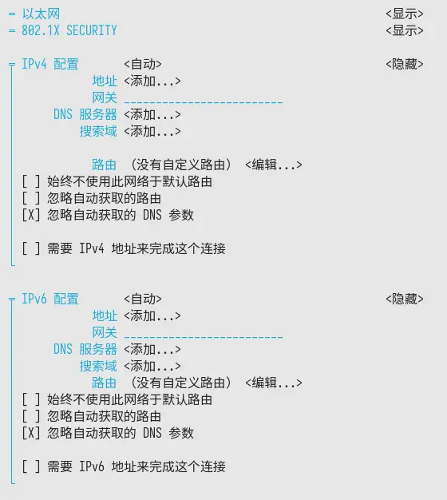

## 前言

在 `/etc/systemd/resolved.conf` 中配置的 DNS，优先级总是低于接口配置的 DNS

按照 `接口DNS -> 接口DHCP DNS -> resolved` 的优先级依次生效

例如使用 `resolvectl status`

```plain
Global
           Protocols: +LLMNR +mDNS DNSOverTLS=opportunistic DNSSEC=no/unsupported
    resolv.conf mode: stub
  Current DNS Server: 223.5.5.5#dns.alidns.com
         DNS Servers: 223.5.5.5#dns.alidns.com
Fallback DNS Servers: 1.0.0.1#cloudflare-dns.com 9.9.9.9#dns.quad9.net 2606:4700:4700::1111#cloudflare-dns.com
                      2620:fe::9#dns.quad9.net
          DNS Domain: ~.

Link 2 (enp34s0)
    Current Scopes: DNS LLMNR/IPv4 LLMNR/IPv6 mDNS/IPv4 mDNS/IPv6
         Protocols: +DefaultRoute +LLMNR +mDNS DNSOverTLS=opportunistic DNSSEC=no/unsupported
Current DNS Server: 2400:3200::1
       DNS Servers: 223.5.5.5 192.168.50.1 2400:3200::1
     Default Route: yes
```

可以看到 `enp34s0` 中已经存在 DNS，这是从 DHCP 中获取的

但我们想要全局控制 DNS，在 `/etc/systemd/resolved.conf` 中配置的 DNS 作为全局生效

## 配置

### systemd-networkd

在对应接口的 network 文件，例如 `/etc/systemd/network/enp34s0.network` 中禁用 DHCP DNS

```conf
[Network]
DHCP=yes

[DHCPv4]
UseDNS=no

[DHCPv6]
UseDNS=no
```

### NetworkManager

这里使用 `nmtui`，在 `编辑连接-选择接口` 中，分别在 IPv4 配置 和 IPv6 配置中，勾选 `忽略自动获取的DNS参数`，使用空格在选项上打钩



配置完成后应该如下，接口的 DNS 会消失

```plain
Global
           Protocols: +LLMNR +mDNS DNSOverTLS=opportunistic
                      DNSSEC=no/unsupported
    resolv.conf mode: stub
  Current DNS Server: 223.5.5.5#dns.alidns.com
         DNS Servers: 223.5.5.5#dns.alidns.com
Fallback DNS Servers: 1.0.0.1#cloudflare-dns.com
                      9.9.9.9#dns.quad9.net
                      2606:4700:4700::1111#cloudflare-dns.com
                      2620:fe::9#dns.quad9.net
          DNS Domain: ~.

Link 2 (enp34s0)
    Current Scopes: LLMNR/IPv4 LLMNR/IPv6 mDNS/IPv4 mDNS/IPv6
         Protocols: -DefaultRoute +LLMNR +mDNS
                    DNSOverTLS=opportunistic
                    DNSSEC=no/unsupported
     Default Route: no
```
