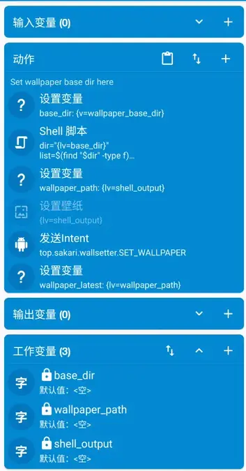
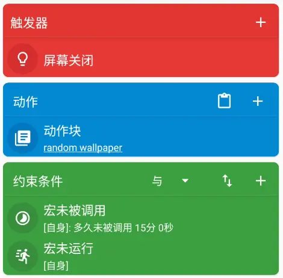

## 前言

### WHY

> 为什么要配置自动壁纸？因为壁纸它就在那里.jpg

在高达上百甚至上千张壁纸的壁纸库中，每次自己来挑一张设置壁纸的操作是及其繁琐的，但这么多壁纸放着不用就等于没存在一样，所以就想办法让它们自动轮换起来。

### HOW

首先排除那些 “Live Wallpaper”，它们会用自己的壁纸实现而非为系统设置壁纸。

这种方式虽然比较自由，且能实现非常多的图片特效，切换特效等。但系统无法从动态壁纸中取色，导致动态配色无效。弃之。

---

现存的部分 app，也只有从某些壁纸网站选取图片并设置的功能，而我的壁纸源是本地图片。弃之。

---

最后找到了两个比较好用且能够满足我的需求（暂时）的 app。

[Anthonyy232/Paperize](https://github.com/Anthonyy232/Paperize) 和 [Hamza417/Peristyle](https://github.com/Hamza417/Peristyle)

这两者都是使用本地目录作为壁纸源，通过定时器设置壁纸轮换间隔，定时器到达后立即更换壁纸。还有一些额外的跳过策略比如熄屏跳过、横屏跳过等功能。

但这种亮屏下更换壁纸的策略，会在壁纸更换时（或者是锁屏再亮屏后）触发动态配色的更新，因而导致某些 app 重载，即使此 app 当前处于前台。

---

在尝试 fork Paperize，为其添加“仅在熄屏时应用壁纸”的功能时，又出现了更多问题。

Paperize 是由定时器驱动的，最初的构想是将壁纸切换的时机推迟到定时器到达之后的第一次熄屏。若在熄屏中触发了定时器，则跳过。

这样的想法虽然看起来简单，但具体实现起来也有很多困难。比如熄屏事件的监听，熄屏后的壁纸切换，定时器的状态管理等。

总之就是改了一坨拉了个大的，于是乎弃之，寻找新的方案。

### 把思路逆转过来

重新审视需求后，发现我的需求只是“在熄屏触发的瞬间切换壁纸”，那么之前的定时器驱动的定时切换就没了意义。

把“定时器控制的定时壁纸切换”，逆转成“由定时器约束切换间隔的熄屏壁纸切换”，这些问题就都得到了解决。

具体流程是：熄屏后检查上次壁纸切换的时间，如果长于设置间隔，则触发壁纸切换，否则跳过。



%%{init: {'flowchart': {'nodeSpacing': 15, 'rankSpacing': 15}, 'themeVariables': {'fontSize': '12px'}}}%%

flowchart TD

    Start([屏幕熄灭事件]) --> GetTime[读取上次壁纸切换时间戳]

    GetTime --> Calc["计算时间差: <br>(当前时间 - 上次切换时间)"]

    Calc --> Decision{时间差 > 设定间隔?}

    Decision -- 是 (True) --> DoChange[触发壁纸切换]
    DoChange --> UpdateTime[更新'上次切换时间'为当前]
    UpdateTime --> End([流程结束])

    Decision -- 否 (False) --> Skip["跳过切换<br>(保持当前壁纸)"]
    Skip --> End



### 实施计划

这个条件能轻易地使用自动化 app 比如 Tasker 和 MacroDroid 实现，这里使用 MacroDroid。

关于设置壁纸的部分可以使用 MacroDroid 内置的设置壁纸动作。

但这个设置壁纸动作可配置项太少，做不到居中裁剪等，因此自行编写了一个通过接收包含图片路径广播并设置壁纸的 app。

至此从问题到落地的链路已经打通，接下来详细展开配置过程。

## 配置

### 安装

首先安装 [MacroDroid - Device Automation](https://www.macrodroid.com/)。

可选安装 [sakarie9/WallSetter](https://github.com/sakarie9/WallSetter)，作为实际的壁纸设置者，如果不安装可以使用 MacroDroid 的设置壁纸动作。注意 WallSetter 安装后需要手动打开一次给予权限。

导入 MacroDroid 宏：[AutoWallpaper.macro](https://github.com/sakarie9/WallSetter/raw/refs/heads/main/AutoWallpaper.macro)

### 动作块

使用 shell 随机选取目录中的一张图片，通过发送 intent 设置壁纸。



脚本部分：

```bash
dir="{lv=base_dir}"
list=$(find "$dir" -type f)
count=$(echo "$list" | wc -l)

if [ "$count" -eq 0 ]; then
  echo "NO_IMAGE_FOUND"
  exit 1
fi

# random number from 0 to count-1
random_number=$(dd if=/dev/urandom bs=4 count=1 2>/dev/null | od -An -tu4 | tr -d '\n')
ran=$(expr $random_number % $count)
ran=$(expr $ran + 1)

selected_file=$(echo "$list" | sed -n "${ran}p")
#basename "$selected_file"
echo "$selected_file"
```

### 宏



重点在于使用约束条件设置调用间隔或者叫调用冷却，确保短时间内多次熄屏操作不会高频触发动作。

## 结语

MacroDroid + WallSetter 的组合意外的简单可靠，MD 本身的后台内存占用以及 CPU 占用都不高，使用广播拉起的 WallSetter 也能在熄屏时触发壁纸更换。壁纸更换之后系统会在后台自动进行动态颜色取样，在下次亮屏之前就能够完成颜色的切换。

相比定时器方式，此方案能保证壁纸的变更和动态取色的变色过程发生在不可见阶段，且实现也更健壮。

总之，满足了我的需求，且实现也不复杂，算是一个不错的方案了。
